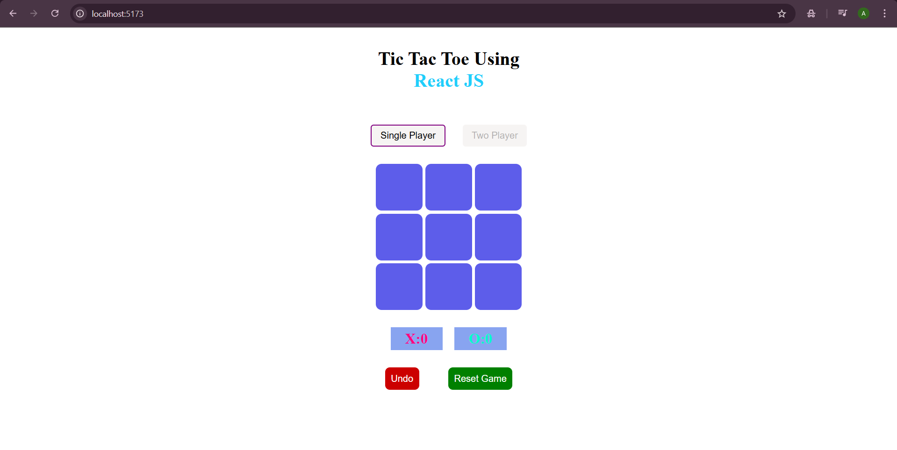
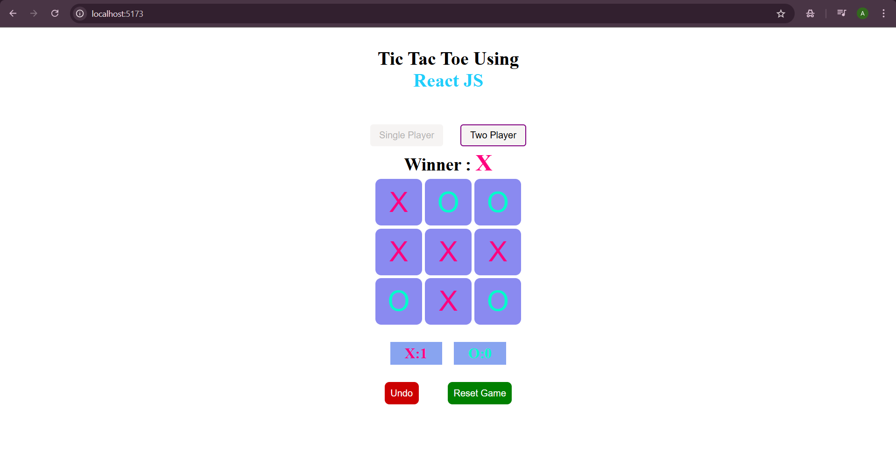
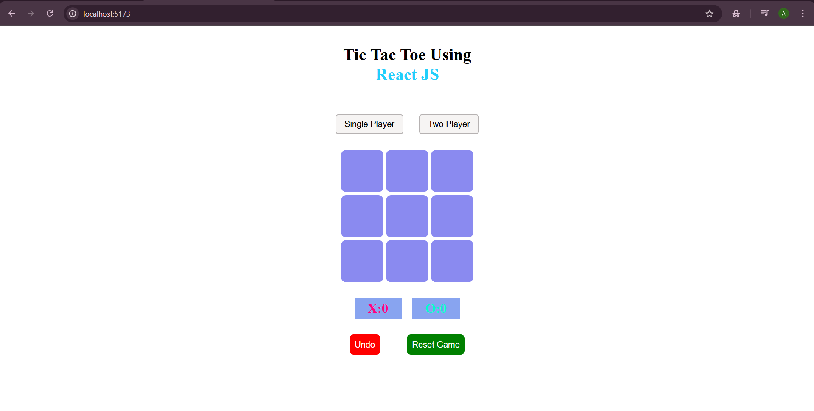

# 🎮 Tic Tac Toe (React JS)

A fun and interactive **Tic Tac Toe game** built with **React JS**, featuring both **Two Player mode** and **Single Player mode with AI (Minimax Algorithm)**.  
Deployed on **Netlify** 👉 [Play Here](https://luxury-fudge-2d77c5.netlify.app/)

---





---

## ✨ Features

- 🆚 **Two Player Mode** – Classic player-vs-player gameplay.
- 🤖 **Single Player Mode** – Challenge the unbeatable AI powered by the **Minimax algorithm**.
- 🔄 **Undo Move** – Available in 2-player mode to take back the last move.
- 🏆 **Scoreboard** – Tracks wins for both players across multiple rounds.
- 🔁 **Reset Game** – Start a new match anytime.
- 🎨 **Custom Styling** – Modern UI with colored X (pink) and O (cyan).

---

## 🚀 Tech Stack

- **React JS** (with Hooks like `useState`)
- **CSS** for styling
- **Netlify** for deployment

---

## 📖 What I Learned

While building this project, I learned:

-⚡How to use **React Hooks** (`useState`) to manage game state.
-⚡Implementing **conditional rendering** for UI updates (winner, game over, disabling buttons).
-⚡Creating **reusable helper functions** (e.g., checking winner, tie, empty spots).
-⚡Understanding and applying the **Minimax algorithm** in a real project.
-⚡Handling **user interactions** (undo, reset, switching between single/double player modes).
-⚡Deploying a React project to **Netlify**.

---

## 🧠 Minimax Algorithm

The **AI opponent** uses the minimax algorithm to evaluate all possible game outcomes and always makes the optimal move.  
That means in Single Player mode: **you can’t beat it, only draw at best 😉**.

---

## ⚡ Getting Started

1. Clone the repo:
   ```bash
   git clone https://github.com/Abhiho11a/-Web-Dev-Projects.git
   cd Simple Frontend Projects
   cd 04-Tic-Tac-Toe
