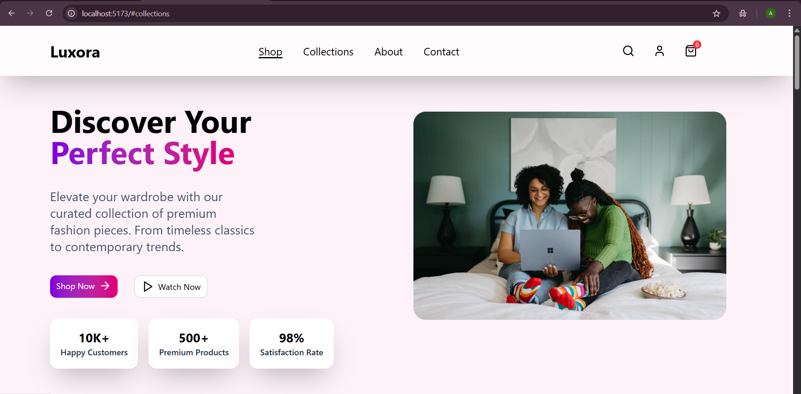

# 🛍 Luxora – Premium Fashion Ecommerce Page  

A modern and responsive ecommerce landing page built with **React** and **Vite**. This project showcases a sleek UI, smooth navigation, and reusable components for a professional shopping experience.  

---

## 🚀 Features  
- ✨ Beautiful, responsive landing page design  
- 🛒 Shop, Collections, About, and Contact sections  
- 🎨 Styled using Tailwind CSS for fast and clean UI  
- 📱 Fully mobile-friendly layout  
- 🔍 Interactive icons (search, user profile, and cart badge)  

---

## 🧰 Tech Stack  
- **React + Vite**  
- **Tailwind CSS**  
- **JavaScript (ES6)**  
- **Git & GitHub** for version control  

---

## 📸 Preview  
  
*(Add the screenshot you took as `screenshot.png` in your repo root.)*  
🌐 **Live Demo:** [View the full page here](https://luxora-web.netlify.app)  


---

## ⚡ Getting Started  

### 1️⃣ Clone the repository  
```bash
git clone https://github.com/abhiho11a/-Web-Dev-Projects-.git
cd Simple Frontend Projects
cd 05-Luxora Ecommerce Page
